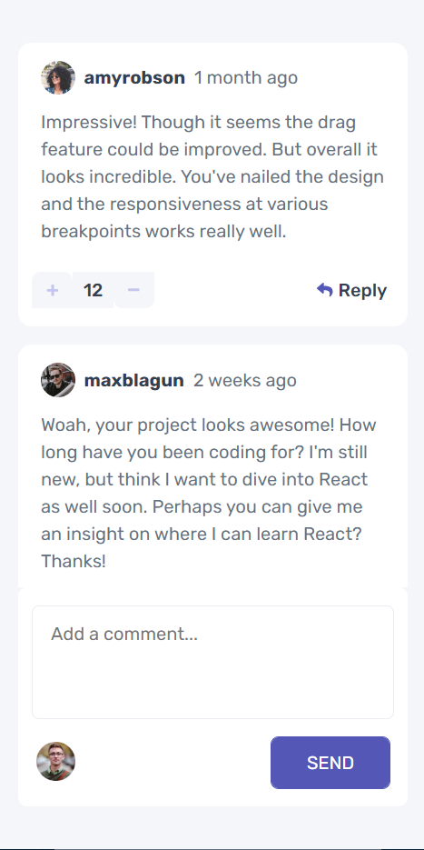

# Frontend Mentor - Interactive comments section solution

This is a solution to the [Interactive comments section challenge on Frontend Mentor](https://www.frontendmentor.io/challenges/interactive-comments-section-iG1RugEG9). Frontend Mentor challenges help you improve your coding skills by building realistic projects. 

## Table of contents

- [Overview](#overview)
  - [The challenge](#the-challenge)
  - [Screenshot](#screenshot)
  - [Links](#links)
- [My process](#my-process)
  - [Built with](#built-with)
  - [Useful resources](#useful-resources)
- [Author](#author)

## Overview

This is my solution to the Interactive Comments Section challenge. The app works well for all viewport widths greatere than 320px. All interactive elements have styling changes when hovering/activating them. The user can create, read, update, and delete comments and replies. The upvote and downvote system is similar to Reddits. Each of the comments `createdAt` field has a specific data string which is read and parsed and compared against a `currentDate` string to generate the appropriate string similar to the design specification images.

### The challenge

Users should be able to:

- View the optimal layout for the app depending on their device's screen size
- See hover states for all interactive elements on the page
- Create, Read, Update, and Delete comments and replies
- Upvote and downvote comments
- **Bonus**: If you're building a purely front-end project, use `localStorage` to save the current state in the browser that persists when the browser is refreshed.
- **Bonus**: Instead of using the `createdAt` strings from the `data.json` file, try using timestamps and dynamically track the time since the comment or reply was posted.

### Screenshot

### Links

- Solution URL: [Frontend Mentor](https://your-solution-url.com)
- Live Site URL: [Github Pages](https://bmagana5.github.io/interactive-comments-section)

## My process

This was, by far, the longest challenges I've done for Frontend Mentor. 
As with other projects, I begin planning out what all of the components will look like and what type 
of data they'll be using. Then, I build out the HTML skeleton and gradually format elements into their 
proper place using Flexbox. Once they're positioned, I add the CSS styles, colors, borders, etc. Lastly, 
I implement reading JSON data into a Context which then can be used by the varying components to access 
the data they need.

### Built with

- SCSS/Sass for styling
- Flexbox
- Mobile-first workflow
- [React](https://reactjs.org/) - JS library

### Useful resources

- [The Cleanest Trick for Autogrowing Textareas](https://css-tricks.com/the-cleanest-trick-for-autogrowing-textareas/) - Textarea input elements do not have a native "autogrow" functionality as you'd expect like divs do. This article by Chris Coyler gives a simple example on how to make your textarea element fill its growing parent container. In a nutshell, you have to generate a new invisible element that is a clone of your textarea style-wise and has the exact text content. This element will grow as the textarea receives text and consequently, the textarea will grow to fill up its parent container.

## Author

Brian Magana
- Frontend Mentor - [@bmagana](https://www.frontendmentor.io/profile/bmagana5)